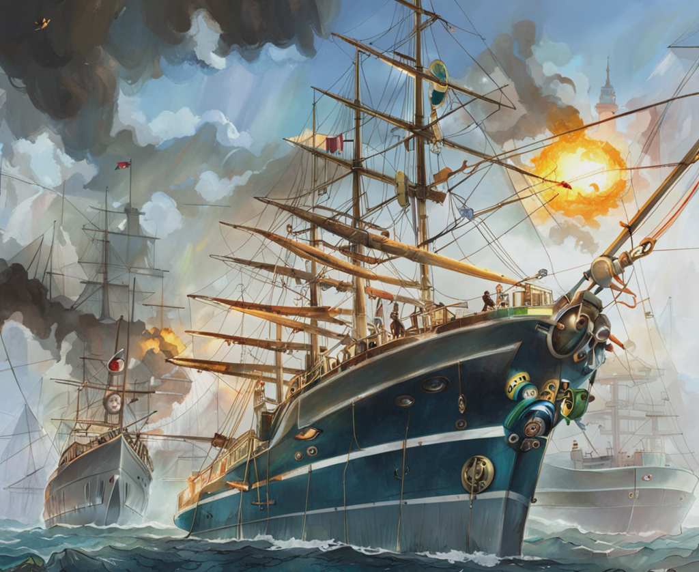

# hundir-la-flota-python

## Hundir la flota con numpy
_Guillermo Bográn y Manuel Lallana_

Primer entregable para el grupo ds-ft-jun23 del bootcamp The Bridge, Madrid.

Juego de hundir la flota usando las librerías numpy y random para generar un tablero con barcos posicionados aleatoriamente y un sistema de turnos donde se juega contra la máquina.

Imagen generada con Stable Diffusion

## Contribuciones

Agradezco a mi colegas de The Bridge Digital Talent Accelerator en Madrid: [Manuel Lallana Babiloni](https://github.com/mlb-alumno) por sus contribuciones a la elaboracion del proyecto.

## Contacto

Para cualquier pregunta o comentario, no dudes en ponerte en contacto conmigo en [info@invex.pro](mailto:info@invex.pro).

## Licencia

Este proyecto está bajo la licencia [Licencia MIT](LICENSE).